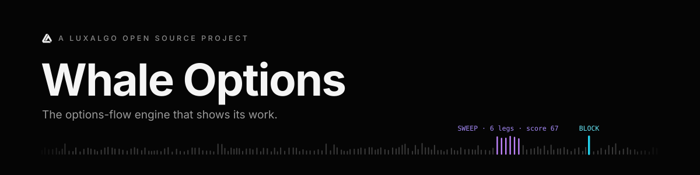
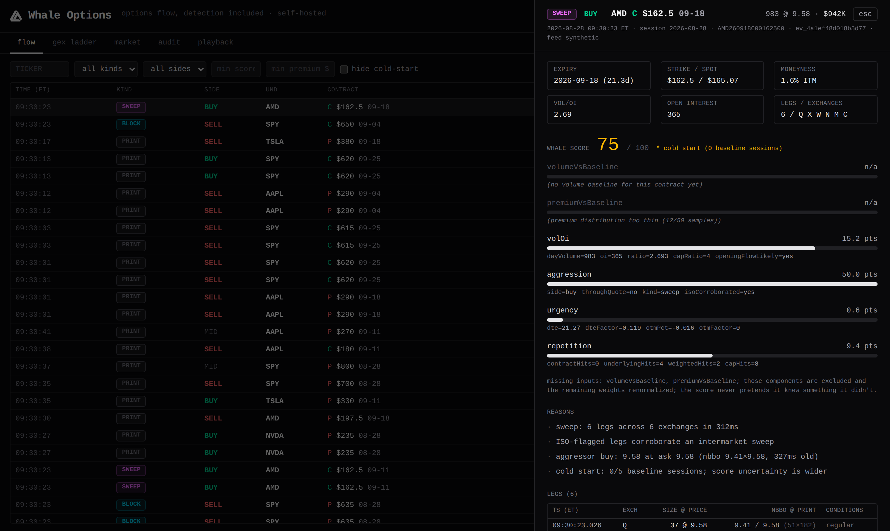
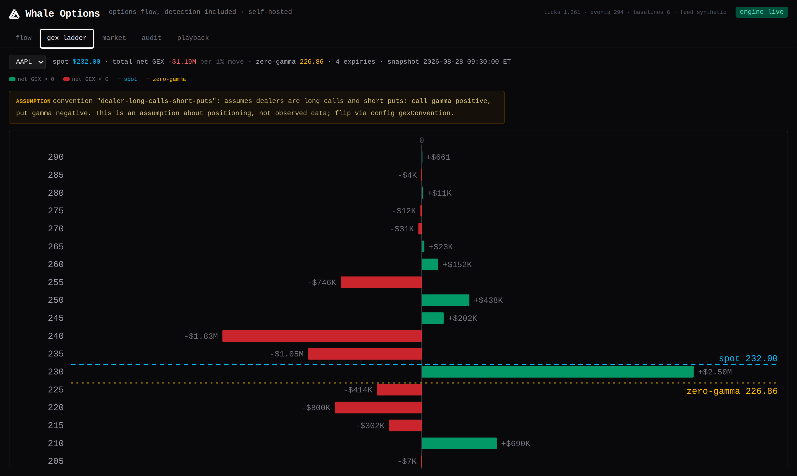
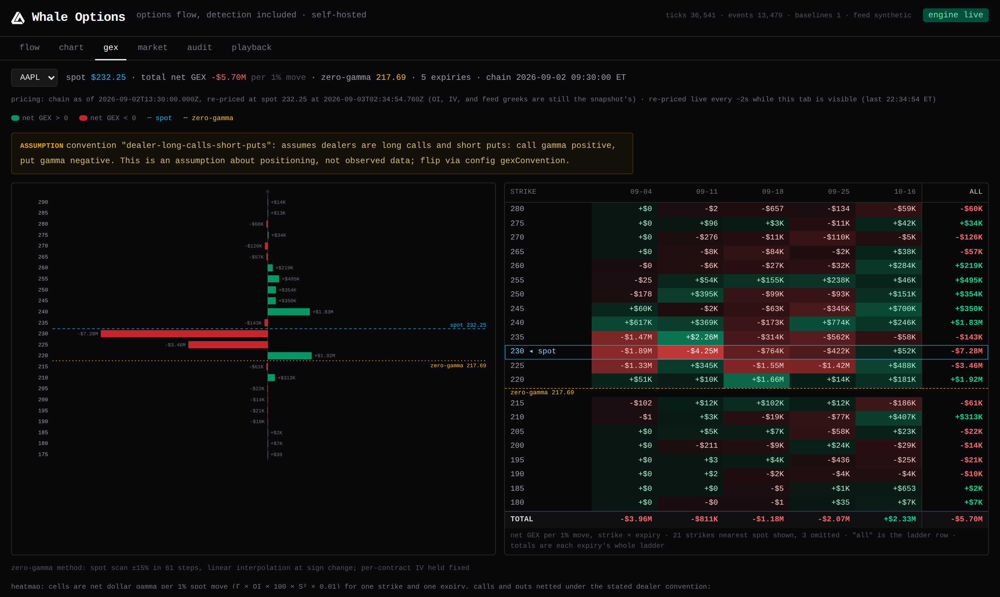
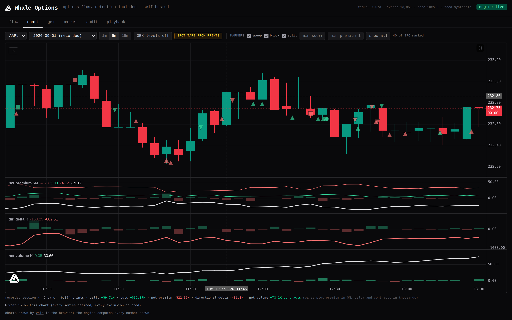

<div align="center">



<br>
<br>

[](https://github.com/LuxAlgo/whale-options/actions/workflows/ci.yml)
[](https://github.com/LuxAlgo/whale-options/actions/workflows/canary-thetadata.yml)
[](https://github.com/LuxAlgo/whale-options/actions/workflows/canary-massive.yml)
[](https://github.com/LuxAlgo/whale-options/actions/workflows/canary-alpaca.yml)
[](https://github.com/LuxAlgo/whale-options/actions/workflows/canary-tradier.yml)
[](package.json)
[](LICENSE)

<sub>The four canary badges are per-feed health: each vendor adapter is exercised daily against that vendor's sandbox or free tier, so a red badge means the adapter drifted from the vendor's API, not that your build broke.</sub>

<br>
<br>

<a href="#the-60-second-demo">Demo</a> · <a href="#bring-your-feed">Feeds</a> · <a href="#classification-sweeps-blocks-splits-and-the-boring-parts-that-make-them-true">Classification</a> · <a href="#gex">GEX</a> · <a href="#charting-flow-on-the-tape">Charting</a> · <a href="#alerts">Alerts</a> · <a href="#flight-recorder-and-replay">Replay</a> · <a href="#measure-it">Audit</a> · <a href="#agent-native-the-mcp-server">MCP</a> · <a href="#documentation">Docs</a>

<sub>Whale Options is a <a href="https://luxalgo.com">LuxAlgo</a> open-source project. Official repository: <a href="https://github.com/LuxAlgo/whale-options">github.com/LuxAlgo/whale-options</a></sub>

</div>

<br>

**Whale Options** is an options-flow engine that runs on your own machine. Point it at your market-data feed (or the built-in synthetic tape, no keys needed) and it watches every options trade as it prints, flags the ones that matter (sweeps, blocks, split orders), and scores each one with the math shown in full: every input, every weight, every missing piece reported. It also computes gamma exposure, fires alerts, serves a local dashboard, and records everything so any session can be replayed and audited.

Options flow was never magic. Open the detection and it's just tape.

## The 60-second demo

Zero keys, synthetic tape, real engine:

```bash
npx @luxalgo/whale-cli run --feed synthetic
```

Everything below is captured from that command against the seeded synthetic feed. No real market data appears anywhere in this repository.

```text
api+ws listening on http://127.0.0.1:8787
dashboard: http://127.0.0.1:8787
feed=synthetic universe=NVDA,SPY,TSLA,AAPL,AMD min-premium=$10,000 db=.whale/whale.db
⋮
09:30:19  PRINT  BUY   NVDA  C $165 08-28      4 @   25.13      $10K  score  39*
09:30:19  PRINT  BUY   SPY   C $630 09-18      6 @   19.87      $12K  score  37*
09:30:20  PRINT  BUY   AAPL  C $205 08-28     35 @   27.27      $95K  score  43*
09:30:20  PRINT  BUY   AAPL  C $220 09-18     21 @   14.38      $30K  score  37*
09:30:20  PRINT  BUY   NVDA  C $195 09-11     21 @    5.45      $11K  score  38*
09:30:21  PRINT  BUY   TSLA  C $265 09-18      7 @   77.63      $54K  score  37*
09:30:23  PRINT  BUY   SPY   C $625 08-28      9 @   20.48      $18K  score  43*
09:30:23  BLOCK  SELL  SPY   C $645 08-28   2210 @    3.30     $729K  score  53*
09:30:23  SWEEP  BUY   AMD   C $162.5 09-11    983 @    8.76     $861K  score  67*   6 legs/6 exch
09:30:25  PRINT  BUY   NVDA  C $160 09-11     12 @   30.88      $37K  score  41*
09:30:26  PRINT  SELL  NVDA  C $172.5 08-28      8 @   17.28      $14K  score  41*
09:30:30  BLOCK  SELL  AMD   P $197.5 09-18    105 @   32.61     $342K  score  39*
```

The `*` after each score is the cold-start marker: the engine has fewer than five baseline sessions for these contracts, so it says so on every line instead of pretending otherwise. Events under the premium floor (default $10,000) are classified but not printed.

### Show the work

Add `--verbose` and every event unfolds its reasoning. Here is that AMD sweep, captured as emitted:

```text
09:30:23  SWEEP  BUY   AMD   C $162.5 09-11    983 @    8.76     $861K  score  67*   6 legs/6 exch
    · sweep: 6 legs across 6 exchanges in 312ms
    · ISO-flagged legs corroborate an intermarket sweep
    · aggressor buy: 8.76 at ask 8.76 (nbbo 8.6×8.76, 327ms old)
    · cold start: 0/5 baseline sessions; score uncertainty is wider
    score breakdown:
      volumeVsBaseline   n/a    (no volume baseline for this contract yet)
      premiumVsBaseline  n/a    (premium distribution too thin (12/50 samples))
      volOi              ██████████··  20.3 pts  dayVolume=983 oi=365 ratio=2.693 capRatio=4 openingFlowLikely=yes
      aggression         ████████████  33.3 pts  side=buy throughQuote=no kind=sweep isoCorroborated=yes
      urgency            █···········   1.2 pts  dte=17.27 dteFactor=0.178 otmPct=-0.0156 otmFactor=0
      repetition         ██████······  12.5 pts  contractHits=0 underlyingHits=4 weightedHits=2 capHits=8
      * cold start (0 baseline sessions)
```

Line by line, this is the entire detection:

- **`sweep: 6 legs across 6 exchanges in 312ms`**: same contract, same aggressor side, six prints across six venues inside a rolling 500 ms window. Legs are held until the window resolves, so none of them was also counted as a standalone event.
- **`ISO-flagged legs corroborate`**: at least one leg carried OPRA's intermarket-sweep-order condition. Corroboration, not the definition: the sweep is established by the multi-exchange burst itself.
- **`aggressor buy: 8.76 at ask 8.76 (nbbo 8.6×8.76, 327ms old)`**: the side is inferred from the NBBO captured at print time (8.76 equals the ask; the quote is 327 ms old, inside the 5 s staleness bound), and that exact quote is stored on the tick. No trustworthy quote means the side is `unknown`, never guessed.
- **`volumeVsBaseline n/a`** and **`premiumVsBaseline n/a`**: two components had nothing defensible to say (no 20-session volume baseline yet; only 12 of the 50 premium samples required). They go null, get listed as missing, and their weight is renormalized across the components that do have inputs. The score never pretends it knew something it didn't.
- **`volOi 20.3 pts`**: 983 contracts traded today against open interest of 365, a ratio of 2.69 log-scaled against a cap of 4. Day volume above OI means positions that did not exist yesterday (`openingFlowLikely=yes`).
- **`aggression 33.3 pts`**: buy at the ask (0.7) + sweep bonus (0.2) + ISO bonus (0.1) = 1.0, the maximum, carrying the largest renormalized weight.
- **`urgency 1.2 pts`**: 17.3 days to expiry decays the DTE factor to 0.178, and the strike is slightly in the money, so the out-of-the-money factor contributes nothing. A low number, reported as low.
- **`repetition 12.5 pts`**: the fifth buy-side event on AMD this session (zero prior on this exact contract, four on the underlying, weighted to 2 hits on a log scale capped at 8).
- **Total: 20.3 + 33.3 + 1.2 + 12.5 = 67.3 → `score 67`.** Weights, caps, bonuses, and floors are all config with documented defaults; see [docs/scoring.md](docs/scoring.md). This arithmetic is what the incumbents sell as proprietary detection.

The engine serves a local dashboard at the same port while `whale run` is up. The same detection on screen, every input reported:



<div align="center"><sub>Live flow on the left; the event drawer on the right with the six score components, the reasons trail, and the NBBO each leg was judged against. Synthetic tape.</sub></div>

## Warm start

Every score in the demo above carries the `*`: a fresh database has no baseline sessions, so the engine spends its first days flagging its own uncertainty instead of hiding it. `whale backfill` kills that cold start. It ingests prior sessions through your feed's historical surface and rebuilds exactly the state finished live sessions would have left behind: per-contract volume baselines, premium and trade-size histograms, daily OI/IV history. Captured against an empty database (synthetic feed, zero keys):

```text
$ whale backfill --feed synthetic --sessions 5 --tickers NVDA,SPY --db /tmp/docs-demo.db
feed=synthetic universe=NVDA,SPY dates=2026-08-18..2026-08-24 (5 weekdays) db=/tmp/docs-demo.db
2026-08-18 NVDA  … 4,000 ticks
2026-08-18 SPY   … 4,000 ticks
2026-08-19 NVDA  … 4,000 ticks
⋮
2026-08-24 SPY   … 4,000 ticks

5/5 sessions ingested: 40,000 ticks across 1,039 contracts, 10 chains folded into daily history
baseline coverage: 0 → 5 sessions (minBaselineDays=5, lookback=20)
```

Then `whale run` against the same database: same engine, same config, first live session, but the scores now rest on history (captured, synthetic):

```text
$ whale events --db /tmp/docs-demo.db --underlying SPY --limit 6
09:30:42  PRINT  BUY   SPY   C $615 09-18      7 @   32.75      $23K  score  42*    ev_820cfa6a053cf690
09:30:41  PRINT  SELL  SPY   C $610 08-28      6 @   34.77      $21K  score  44     ev_f502f7e7e2f9363e
09:30:39  PRINT  MID   SPY   P $745 08-28      4 @   99.87      $40K  score  21*    ev_e31c0d598b26e9ee
09:30:36  PRINT  BUY   SPY   P $785 08-28    115 @  141.03    $1.62M  score  53     ev_92b8ab9a50c31f17
09:30:35  PRINT  SELL  SPY   C $620 08-28      6 @   24.87      $15K  score  42     ev_005e3bb4e3f86c64
09:30:35  PRINT  MID   SPY   P $680 09-04      5 @   34.30      $17K  score  18     ev_4d9a2042a40de3fc
```

Most of the stars are gone. The two that remain sit on contracts new to the chain with no history of their own, and they keep saying so: cold start is per contract, not a global switch. The two components that went missing in the demo now have inputs; from the $1.62M print's breakdown:

```text
      volumeVsBaseline   ············   0.0 pts  dayVolume=115 avgDailyVolume=376.6 multiple=0.31 capMultiple=20
      premiumVsBaseline  ████████████  19.7 pts  premium=1621845 percentile=0.9839 samples=19544
```

Backfill runs the same normalize → condition-policy → accumulate path as a live session (no events, no alerts; it rebuilds end-of-session state only), re-runs idempotently, and never folds a partially ingested day. `--sessions N` walks back N weekdays; `--dates 2026-08-01..2026-08-21` targets a range. Which vendors offer per-print history and as-of-date chains, and what a full-chain crawl costs, is per feed: [docs/feeds.md](docs/feeds.md#historical-backfill).

## Bring your feed

Whale Options has no data business. Adapters connect to the feed you are entitled to; your keys stay in your environment and are sent only to the vendor they authenticate.

| Feed | What you get | Credentials (env vars) | Entitlement path |
|---|---|---|---|
| **Tradier** | Real-time trade stream (timesales carry bid/ask at print, which becomes the tick's NBBO); chains with greeks. Your broker connection is your data feed. | `TRADIER_ACCESS_TOKEN` | Real-time market-data API access is included with a funded brokerage account ($0 beyond funding it); verify scope on [Tradier's current docs](https://documentation.tradier.com/). Sandbox tokens get delayed REST and no streaming. |
| **ThetaData** | Full OPRA trade stream through the locally running Theta Terminal; quotes, OI, and greeks by subscription tier (enrichment degrades to nulls where your tier stops). | none; auth lives in the local Theta Terminal (`THETADATA_BASE_URL` / `THETADATA_WS_URL` relocate it) | Tiered: a free end-of-day tier exists; paid tiers add real-time quotes, OI, and greeks; streaming starts at their standard options tier. See [ThetaData's pricing](https://www.thetadata.net/). |
| **Alpaca** | The indicative options feed (derived quotes/trades) as the zero-dollar live path; chain snapshots with greeks/IV (no open interest, and the affected score component reports itself missing). | `ALPACA_API_KEY_ID`, `ALPACA_API_SECRET_KEY` | Free signup gets the `indicative` feed; their paid market-data subscription gets full OPRA (`opra`). See [Alpaca's data plans](https://alpaca.markets/data). |
| **Massive** (formerly Polygon) | Options trades over WebSocket, per underlying or the whole market; chain snapshots with greeks, IV, and OI. | `MASSIVE_API_KEY` (`POLYGON_API_KEY` accepted) | Delayed options on the entry tier; real-time OPRA with greeks on advanced. See [Massive's pricing](https://massive.com/). |
| **synthetic** | Seeded, statistically plausible tape with injected sweeps, blocks, ladders, and spread legs: the demo above and the test substrate. | none | none; zero keys, zero dollars. |
| **replay** | Your own recorded tapes (`whale run --record`), byte-for-byte deterministic. | none | whatever you were entitled to when you recorded it. |

Entitlement structure as the vendors describe it at the time of writing; prices drift, so follow the links for current numbers.

Per-vendor plumbing worth knowing up front: **Tradier** subscribes per option symbol (no full-market stream), so it requires explicit `universe.underlyings` in your config. **ThetaData** needs the Theta Terminal running locally (the adapter speaks Terminal v3). **ThetaData and Alpaca** stream the full universe and filter to your underlyings client-side, so budget bandwidth accordingly. Full setup per vendor: [docs/feeds.md](docs/feeds.md).

## Classification: sweeps, blocks, splits, and the boring parts that make them true

**Aggressor side** comes from the NBBO at print time: at/above the ask is a buy, at/below the bid is a sell, between is `mid`. No quote, a stale quote (older than 5 s), or a sale condition that voids the timestamp means `unknown`. The engine refuses to guess, and the quote it judged against is stored on the tick so the call stays defensible after the fact.

**Sweeps** are same-contract, same-side prints across two or more exchanges inside a rolling 500 ms window. Prints that might become sweep legs are held until the window resolves, so nothing is counted twice. ISO sale conditions corroborate (and add a small aggression bonus) but do not define the sweep.

**Blocks** clear a *dynamic* size threshold: the 99.5th percentile of the trade-size distribution for the contract's liquidity bucket, floored per bucket (50/100/250/500 contracts). Buckets come from the contract's own 20-session average volume. Fixed thresholds are how flow tools end up flagging routine prints on illiquid names; percentile thresholds are how 105 contracts can honestly be a block in one name while 2,000 is background in another.

**Splits/ladders** are four or more same-contract, same-side clips worked over minutes without multi-exchange simultaneity: the iceberg worked over time. A split event's legs reference clips that already printed as their own events, by design.

Spread legs and cancels are the classic false-positive source in retail flow tools, so the sale-condition policy is explicit, and a print is only as eligible as its most restrictive condition:

| Condition | Scored | Joins sweeps | Block-eligible | Counts volume | Aggressor side |
|---|---|---|---|---|---|
| regular / auto / ISO | yes | yes | yes | yes | from NBBO |
| spread leg (incl. tied-to-stock) | **no** | no | no | yes | never assigned |
| auction / cross | no | no | no | yes | forced unknown |
| floor | yes | **no** | yes | yes | from NBBO |
| late / out-of-sequence | yes | **no** | yes | yes | forced unknown |
| cancel | no | no | no | **voids volume** | forced unknown |
| reopening | no | no | no | yes | forced unknown |
| unmapped vendor code | yes | yes | yes | yes | from NBBO, event flagged for review |

So a multi-leg spread's legs count toward volume but never become directional "conviction". Late-reported prints can still be blocks (a late-reported block is a real signal) but never anchor a sweep window or a side call. Cancels void a matching leg still sitting in an open window and decrement day volume. Already-emitted events are never retracted; that limit is documented, not hidden. Full mechanics: [docs/classification.md](docs/classification.md).

## GEX

`whale gex <underlying>` computes per-strike dollar gamma per 1% spot move (Γ × OI × 100 × S² × 0.01), net across calls and puts, plus the zero-gamma level. Greeks come from your feed when provided; otherwise Black-Scholes with a Brent IV solve from the quote midpoint. Captured from the synthetic chain:

```text
$ whale gex NVDA --db /tmp/docs-demo.db --expiry 2026-09-18
NVDA spot 190  ·  total GEX $93K per 1% move  ·  zero-gamma ~191.48
convention dealer-long-calls-short-puts: assumes dealers are long calls and short puts: call gamma positive, put gamma negative. This is an assumption about positioning, not observed data; flip via config gexConvention.
expiries: 2026-09-18
       ⋮
       185    -$378K ██████████████████
     187.5    -$149K ███████
       190     $568K ████████████████████████████
     192.5    -$317K ███████████████
       195      $83K ████
       ⋮
```

That convention line ships in every output (CLI, API, MCP) because the dealer-positioning sign is an assumption, not observed data. The zero-gamma level states its own method too: `spot scan ±15% in 61 steps, linear interpolation at sign change; per-contract IV held fixed`. Tools that print these numbers without the caveat are making the same assumption silently; this one makes it in writing and lets you flip it in config.



<div align="center"><sub>The same ladder in the dashboard's gex tab: per-strike net GEX, spot and zero-gamma levels, and the assumption banner that never goes away. Synthetic chain.</sub></div>

The gex tab also renders the ladder as a **strike-by-expiry heatmap** (`GET /api/gex/:underlying/heatmap`, MCP `whale_gex_heatmap`): rows are the strikes nearest spot, columns the chain's expiries, each cell the net GEX per 1% move for that strike and expiry, with per-expiry totals, the all-expiry ladder as the last column, the spot row highlighted, and zero-gamma marked between the rows it falls in. While the tab is visible, both the ladder and the grid are **re-priced at the latest spot from the live stream every ~2 seconds without refetching the chain** (`?spot=`): OI, IV, and feed greeks stay as snapshotted, only the gamma weights move, and the payload's pricing line says exactly that: `chain as of <ts>, re-priced at spot <x> at <ts>`. Old open interest evaluated at a new price is not a new chain, so the output never lets you mistake one for the other.



<div align="center"><sub>Ladder and heatmap side by side, re-priced live at the latest spot; the pricing line above them states the chain time and the re-pricing time. Seeded synthetic feed.</sub></div>

## Charting: flow on the tape

The dashboard's **chart** tab puts the flow on a price chart, drawn in the browser by [Vela](https://github.com/LuxAlgo/Vela), LuxAlgo's open-source charting library (Apache-2.0, loaded on first visit so the flow table's bundle is unchanged). The engine computes every number on it; the chart is a window.



<div align="center"><sub>A recorded session on the chart tab at 5-minute bars: candles from the spot tape (the badge says so), the 40 largest sweeps/blocks/splits by premium marked at their time and spot (the marker filter defaults to that; "show all" paints every event), and the three per-print panes in $M / thousands; the session totals sit under the chart and the full series definitions and exclusion counts open from the "what is on this chart" disclosure. Seeded synthetic feed.</sub></div>

What is on it, and what each series is:

- **Price pane: the underlying's candles.** From the feed's equity bars when the vendor serves them (`FeedAdapter.getUnderlyingBars`: Alpaca and Massive today; the synthetic feed serves its own seeded spot walk so the zero-key demo has candles), otherwise from the **spot tape from prints**: the underlying-price observations that rode on the option prints, folded to the timeframe. A bar then exists only where options printed, there is no share volume, and the tab shows a `SPOT TAPE FROM PRINTS` badge. `GET /api/bars/:underlying?tf=1m` names its `source` in every payload.
- **Markers: the engine's sweeps, blocks, and splits**, at each event's timestamp and spot, sized by premium (log scale), colored by aggressor side, calls above the bar and puts below, shape by kind. A marker filter (kinds, min score, min premium) defaults to the session's 40 largest by premium so the candles stay legible; the count reads "40 of 276 events marked" and "show all" paints the whole event tape. Hover for the print, click for the same event drawer the flow table opens: the full score breakdown, the reasons trail, and the NBBO each leg was judged against. The premium floor applies to markers (they are emitted events) and to nothing else on the chart.
- **Net premium pane: built from every normalized print**, floor or no floor. Sign comes from the aggressor side against the NBBO stored on the print: at or above the ask is a buy (+), at or below the bid a sell (−). Mid prints, unknown sides, and sale conditions that void the side (spread legs, auctions, crosses, late reports) are excluded from every signed series and counted as `unsided` in the payload; cancels are counted and otherwise ignored, nothing is retracted. Calls (green) and puts (red) are cumulative per session, the net line is `callNet − putNet` (bullish-positive, the same convention as `whale market netflow`), and per-bucket net premium prints as faint columns.
- **Directional delta pane:** `Σ delta × size × 100 × sign` over sided prints. Delta comes from the chain snapshot's greeks when the run has them, otherwise Black-Scholes from the print's own NBBO mid (IV solved), spot, strike, and time to expiry; a print with no derivable delta is excluded from this series and counted as missing, never guessed. The payload's `deltaSource` states the split in words.
- **Net volume pane:** buy contracts minus sell contracts, per bucket and cumulative.
- **GEX levels (toggle, off by default):** per-strike net GEX from the current chain drawn as bars anchored to the price axis, zero-gamma dashed; a strip under the chart carries the dealer-convention assumption, the pricing line, and how many strikes are in view (and says "zoom out" when none are).

Buckets are one minute by default (`flowSeries.bucketMs`), values reset per session date, and the series persist in the flight recorder, so the session picker offers today live plus every recorded session, and a replayed tape reproduces the same buckets byte for byte (tested). Live updates arrive over the same `/ws` stream the flow table uses; nothing rebuilds. `GET /api/flow/:underlying/series?session=` and MCP `whale_flow_series` serve the same buckets with the same `note`, which says exactly what is and is not included.

## Market structure

`whale market` reads the flight recorder's daily-history layer (the tables live sessions and `whale backfill` fold) and answers four structural questions, each output stating its window and its caveats:

- **`whale market oi <underlying>`**: session-to-session open-interest deltas per contract, strike, and expiry. OI settles overnight, so session-to-session is the honest unit of change; deltas describe what changed, never who opened it or why.
- **`whale market maxpain <underlying>`**: the OI-weighted max-pain strike per expiry.
- **`whale market ivrank <underlying>`**: IV rank/percentile over *recorded* ATM-IV history; the note states the real window whenever it is shorter than the 52-week convention.
- **`whale market netflow`**: net premium per underlying over a window, aggregated from emitted events only (the premium floor applies; this is the recorded event tape, not total market volume).

Captured from the backfilled synthetic database above:

```text
$ whale market maxpain NVDA --db /tmp/docs-demo.db
NVDA max pain  ·  spot 190  ·  source: chain snapshot 2026-08-25T13:30:00.000Z
  2026-08-28  strike 182.5  payout-at-strike $22.98M  callOI 16583  putOI 10248  (39 strikes)
  2026-09-04  strike 190  payout-at-strike $25.74M  callOI 14461  putOI 14281  (39 strikes)
  2026-09-11  strike 190  payout-at-strike $24.40M  callOI 14568  putOI 14509  (39 strikes)
  2026-09-18  strike 187.5  payout-at-strike $24.03M  callOI 12340  putOI 11058  (39 strikes)
  note: max pain is the strike minimizing total intrinsic value paid to option holders at expiration, OI-weighted (payout(S) = Σ calls OI×max(0,S−K)×100 + Σ puts OI×max(0,K−S)×100, evaluated at each listed strike); a static computed from current open interest, not a prediction of where price will go
```

Every `whale market` output carries a note like that one, and the same computations reach agents as MCP tools with the notes in the payload.

## Short-volume context

`whale context short-volume <symbol> --sync` caches FINRA's public daily short-sale volume files (off-exchange trades reported to FINRA facilities, published end-of-day) in your own flight recorder and reports per-session short ratios against the symbol's own history. Every report ships the standing note: short volume is not short interest, and market-maker hedging prints short structurally, so elevated ratios are the mechanical norm. What the data is, what it is not, and how the sync works: [docs/context.md](docs/context.md).

## Alerts

Rules are plain JSON predicates over events. No DSL, no rule-builder upsell:

```json
{
  "id": "nvda-big-sweeps",
  "match": { "tickers": ["NVDA"], "kind": ["sweep"], "minScore": 75, "minPremium": 250000 },
  "sink": { "type": "discord" },
  "cooldownSec": 300
}
```

Five sinks: `stdout`, `webhook`, `discord`, `telegram`, `desktop`. The webhook sink posts either the full event (score breakdown included) or an `order-signal` template (the compact ticker/action body webhook-driven executors accept), and can sign payloads with HMAC-SHA256. Sink credentials are **env-var names, never raw secrets**: the config says `WHALE_DISCORD_WEBHOOK_URL`, the environment holds the value. Cooldowns are per rule + contract. Every fired alert stores its event id in the `alerts_fired` table, so any alert traces back to the complete event story, replayable end to end. By default rules skip cold-start scores (`excludeColdStart: true`). Details: [docs/alerts.md](docs/alerts.md).

## Flight recorder and replay

Every tick is stored **self-contained**: the NBBO used for the aggressor call, the underlying spot, and the open interest ride on the tick itself. The engine does zero I/O and zero lookups, which buys the determinism contract:

**Same tape + same config ⇒ byte-identical event stream, ids included.**

That is a tested property, not a slogan (two replays of the same recorded tape hash identically). It makes the flight recorder auditable: `whale replay` re-runs any tape file or any store window through the *current* config, and `--diff` shows exactly what would have changed. Change your weights, then see precisely what today would have flagged:

```text
$ whale replay --db /tmp/docs-demo.db --from 2026-08-25T13:30:00Z --to 2026-08-25T20:00:00Z --diff --quiet
replayed 115 stored ticks
diff vs store: 0 added, 0 removed, 0 score-changed (of 41 stored)

# after raising the aggression weight and the premium floor in whale.config.json:
$ whale replay --config whale.config.json --db /tmp/docs-demo.db --from ... --to ... --diff --quiet
replayed 115 stored ticks
diff vs store: 0 added, 18 removed, 23 score-changed (of 41 stored)
  - print NVDA260911P00182500 score 43.1
  - print SPY260918C00615000 score 42
  ⋮
  ~ SPY260911P00670000 29.8 → 36.5
  ~ NVDA260828C00165000 36.5 → 42.1
  ⋮
```

(Synthetic session, captured live. Zero drift under the same config is the determinism contract demonstrating itself.) Replay never re-fires alerts and never writes events. Recording (`whale run --record tape.ndjson`), retention knobs, and the live-vs-replay caveat: [docs/replay.md](docs/replay.md).

## Measure it

The incumbent platforms market performance claims nobody can check; Whale Options ships the measuring instrument and makes no claims. `whale audit` calibrates the scores *your* recorder produced against what the underlying actually did afterwards: score bins, kinds, and sides versus forward returns at a chosen horizon, every bucket compared to the tape's own base rate and to the 50% coin flip. It measures moves of the underlying, never option P&L, and its caveats block prints with every report because the caveats are part of the result, not a disclaimer. Small buckets are flagged as noise; excluded events are counted, not hidden. Captured on the synthetic database above (truncated; the full tables and caveat list are in [docs/audit.md](docs/audit.md)):

```text
$ whale audit --db /tmp/docs-demo.db --horizon eod
calibration: horizon eod  window 2026-08-25T13:30:00.116Z → 2026-08-25T13:30:49.719Z
41 events considered, 30 with an outcome; excluded: 11 mid, 0 unknown side, 0 no price data

by score bucket
bucket         n   median fwd    mean fwd   aligned   vs base
20-30          1      -0.002%     -0.002%      0.0%   -40.0pt  (n<30, noise)
30-40          9      +0.031%     +0.023%     22.2%   -17.8pt  (n<30, noise)
40-50         17      +0.031%     +0.035%     47.1%    +7.1pt  (n<30, noise)
⋮
base rate (all events with an outcome, same window): aligned 40.0%, median fwd +0.031%; coin flip is 50%
⋮
caveats, read before quoting any number:
  · Returns are moves of the UNDERLYING, not option P&L. No transaction costs, spreads, slippage, or exercise mechanics are modeled; an aligned underlying move does not imply the option made money. That is also why no option win rate is computed here: option P&L is path-dependent and spread-dependent, and a number we could not defend would be worse than none.
  · Correlation is not causation. A calibration table is a measurement of one recorded window, not a forecast and not trading advice.
  · SYNTHETIC TAPE: this window contains events from the seeded synthetic feed. Outcomes are meaningless by construction; this run demonstrates the instrument only.
```

Measurement, not advice: the framing is load-bearing and the tool enforces it. Horizons, forward-price sources, and the full report schema: [docs/audit.md](docs/audit.md).

## Cross-validate the feed

`whale compare` runs two feeds over the same window and diffs the tapes: prints one vendor delivered and the other missed, sale-condition disagreements on matched prints, and timestamp skew between them. The point is honest and mechanical. Your detection is only as good as your feed, and the only defensible way to judge a feed is against another feed you are also entitled to, not against a marketing page. Details and flags: [docs/compare.md](docs/compare.md).

## Agent-native: the MCP server

`@luxalgo/whale-mcp` exposes the flight recorder to any MCP client over stdio or local HTTP. Sixteen tools:

| Tool | What it answers |
|---|---|
| `whale_status` | Live engine or recording? Tape depth, baseline warmth: the right first call |
| `whale_recent` | The latest flow, filterable by ticker/kind/side/premium |
| `whale_top` | Highest-scored events in a window, full component breakdowns attached |
| `whale_event` | One event's complete story: every leg, its sale conditions, the NBBO it was judged against |
| `whale_gex` | The GEX ladder + zero-gamma, sign convention stated in the payload |
| `whale_rules` | List/add/remove alert rules |
| `whale_replay` | Re-run a stored window under the current config and diff against what was recorded |
| `whale_oi_deltas` | Session-to-session open-interest change per contract, strike, and expiry: what changed overnight in a chain |
| `whale_max_pain` | Per-expiry max-pain strike, the static-not-prediction note carried in the payload |
| `whale_iv_rank` | IV rank/percentile over recorded ATM-IV history, real window stated |
| `whale_net_flow` | Net premium flow leaderboard per underlying; emitted events only, sign convention in the note |
| `whale_audit` | Calibrate recorded scores against forward underlying moves; a measurement of your own tape, caveats always attached |
| `whale_short_volume` | Cached FINRA daily short-sale volume; end-of-day context, read from the local cache only |
| `whale_flow_series` | The per-print flow series behind the chart tab: bucketed net premium, directional delta, net volume; no premium floor, delta source and exclusions stated in the note |
| `whale_bars` | Underlying bars from the spot tape (the prints' own spot observations); the source is stated because they are not exchange bars |
| `whale_gex_heatmap` | The strike-by-expiry GEX grid with totals and zero-gamma, re-priceable at a live spot; convention assumption and pricing line in the payload |

The demo moment: ask your agent *"anything sweeping NVDA today? how big a deal is it, and show your work."* It calls `whale_status`, pulls `whale_top`, and answers from the components (premium percentile, volume against open interest, aggression, what was missing and renormalized) instead of reciting a number, then offers the leg-by-leg audit trail. Setup and the full tool reference: [docs/mcp.md](docs/mcp.md).

## Dashboard

A thin local web UI: live flow table with filters, an event drawer showing the full score breakdown and reasons trail, the chart tab (candles, per-print flow panes, event markers, GEX levels; drawn by [Vela](https://github.com/LuxAlgo/Vela), loaded on first visit), and the GEX ladder with its heatmap (all pictured above). A market tab renders the `whale market` analytics with the same notes the CLI prints. An audit tab renders the calibration report, caveats inline. A playback tab steps through a recorded window event by event. It is served by the engine itself at its port (default `http://127.0.0.1:8787`) whenever `whale run` is up; there is no separate process and no separate state. The engine is the product; the UI is a window.

## What it deliberately does not do

- **No real-time dark-pool prints.** Real-time off-exchange data requires licensing that does not self-serve; a tool implying it shows you real-time dark-pool options flow is showing you something else. The honest substitute is end-of-day short-volume context, and it ships: `whale context short-volume` ([docs/context.md](docs/context.md)).
- **No hosted mode, no multi-tenant anything, ever.** Market-data entitlements are personal licenses. This runs on your machine, against your feed, for you. A hosted version would be reselling your data feed back to you.
- **No order execution.** The engine emits signals. The webhook `order-signal` template speaks the compact ticker/action format webhook-driven executors accept, and that is the entire relationship to execution.
- **No advice, no win-rate claims, no "smart money" narratives.** Prints, classifications, and arithmetic, with the work shown.

## Principles

MIT licensed. **No telemetry**: the engine phones home to no one, ever. Self-host only. We don't want your keys, and we don't resell your feed. Every score shows its components; every classification shows its reasons; every assumption (sign conventions, thresholds, weights) is config with documented defaults. Servers bind loopback by default. Sample data in this repository is synthetic and labeled as such.

Whale Options is an independent project by [LuxAlgo](https://luxalgo.com). It is not affiliated with, endorsed by, or derived from any commercial flow platform.

## Packages

| Package | What it is |
|---|---|
| `@luxalgo/whale-core` | The pure engine: normalize → classify → score → emit, plus feeds, greeks, alerts, and the flight recorder |
| `@luxalgo/whale-cli` | `whale run · replay · backfill · audit · market · context · compare · gex · events · rules · bench` |
| `@luxalgo/whale-mcp` | Local MCP server over your flight recorder |
| `@luxalgo/whale-dashboard` | Minimal local web UI (charts by [Vela](https://github.com/LuxAlgo/Vela), Apache-2.0; see [THIRD_PARTY_NOTICES.md](THIRD_PARTY_NOTICES.md)) |

## Documentation

| Doc | Covers |
|---|---|
| [docs/architecture.md](docs/architecture.md) | Dataflow, the determinism contract, module map, adding a feed adapter |
| [docs/scoring.md](docs/scoring.md) | Every score component's formula, defaults, renormalization, a worked example |
| [docs/classification.md](docs/classification.md) | Aggressor rules, sweep windows, block thresholds, ladders, the full condition policy |
| [docs/feeds.md](docs/feeds.md) | Per-vendor setup, entitlements, quirks, historical backfill coverage, the adapter contract, canaries |
| [docs/replay.md](docs/replay.md) | Recording, replaying, `--diff`, retention, bench |
| [docs/audit.md](docs/audit.md) | Score calibration: what `whale audit` measures, forward-price sources, the caveats |
| [docs/context.md](docs/context.md) | FINRA short-sale volume: what the data is and is not, syncing, the standing note |
| [docs/compare.md](docs/compare.md) | Feed cross-validation: diffing two feeds over the same window |
| [docs/alerts.md](docs/alerts.md) | Rule schema, sinks, webhook templates, the audit trail |
| [docs/mcp.md](docs/mcp.md) | MCP server setup and the sixteen-tool reference |

## Development

```bash
pnpm install
pnpm build        # build before typecheck: cli and mcp typecheck against core's built d.ts
pnpm typecheck
pnpm test         # unit + golden + property + determinism suites
pnpm lint
```

Contributions welcome. [CONTRIBUTING.md](CONTRIBUTING.md) has the test map, the golden-tape rules, and how to add a feed adapter.

## License

[MIT](LICENSE) © LuxAlgo Global, LLC. The code is free; the name is a trademark: [TRADEMARKS.md](TRADEMARKS.md). Vulnerability reports go privately through [SECURITY.md](SECURITY.md).
